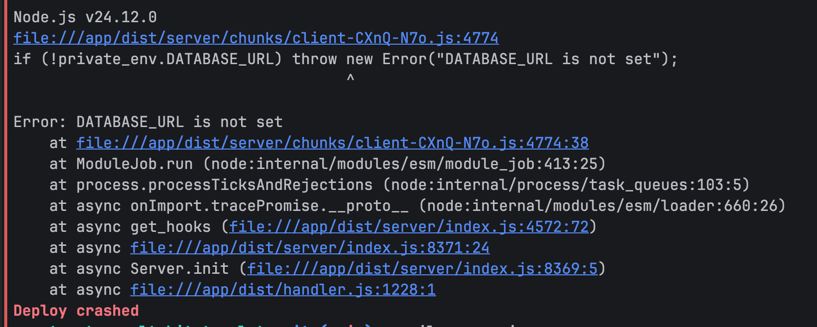
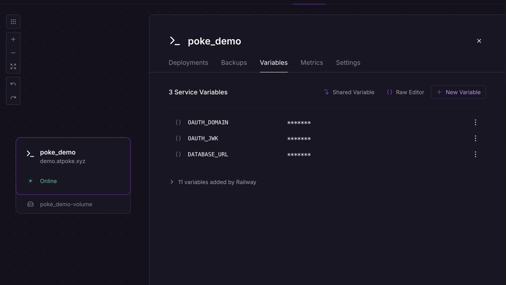
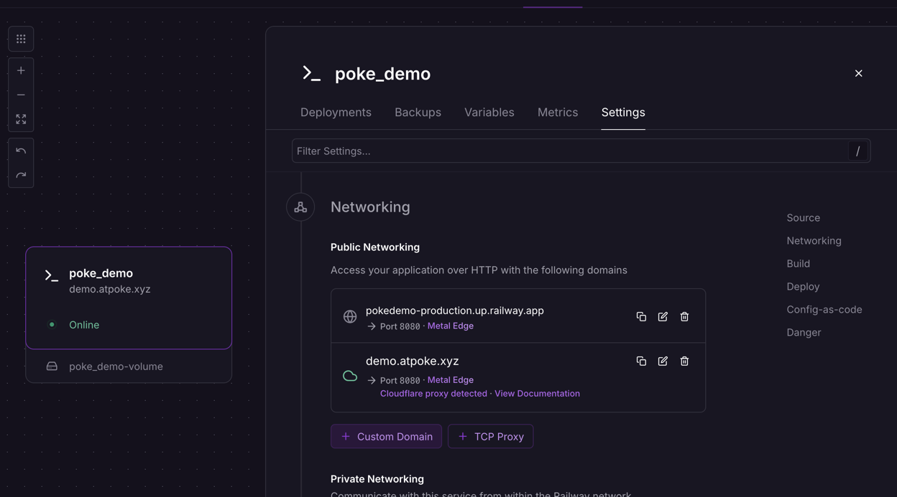

# atkuzu

A game built on the [AT Protocol](https://atproto.com), inspired by [AT Mot](https://atmot.herve.bzh).

atkuzu = AT Protocol + [Takuzu](https://en.wikipedia.org/wiki/Takuzu) (aka Binairo). Players solve a daily puzzle; results are written to their own PDS as atproto records.

This is a SvelteKit app with browser OAuth already wired up: users log in with their own AT Protocol handle (Bluesky or any other PDS), and actions are taken on their behalf against their own repo. There is no game logic here yet, this is the OAuth/session/DB scaffolding the game will be built on.

Forked from the [atproto-sveltekit-template](https://tangled.org/pds.dad/atproto-sveltekit-template) — see [NOTICE.md](NOTICE.md) for attribution.

## Dev Setup

Should work with any package manager if you prefer to use another. But these are directions for [pnpm](https://pnpm.io/)

1. Copy [.env.example](.env.example) to [.env](.env), .env.example is the default dev settings
2. `pnpm install`
3. May need to run `pnpm approve-builds` for the build scripts for sqlite
4. `pnpm run dev` or `pnpm run dev:logging` with [pino-pretty](https://github.com/pinojs/pino-pretty) for pretty logging

> If you are running locally on a different port than `5173` or something else odd can set `OAUTH_DOMAIN` in `.env` to the domain and port. Just make sure to use either `127.0.0.1` or `[::1]` (ipv6) for oauth to work for local development.

## Implementation details

### How OAuth is configured

OAuth is configured entirely from environment variables, no code changes needed.

> All atproto actions taken for the user happen server side, so we can take advantage of the confidential client and longer session lifetimes.

### Types of OAuth clients

- Development local — Set `DEV=true` in `.env` to use a local development client. This is a special client just for development, it does not require a public url. As outlined [here](https://atproto.com/specs/oauth#localhost-client-development). This is the default from copying [.env.example](.env.example)
- Production Public — Remove `DEV=true`, set `OAUTH_DOMAIN` to your publicly accessible domain in `.env` to use a production public client. These have a lower atproto oauth session lifetime, limited to 2 weeks.
- Production Confidential — Follow `Production Public` and set `OAUTH_JWK` to the value from `node ./bin/gen-jwk.js`. **These are cryptographic signing keys and should be kept secret and private**. These have the longest session lifetime: 180 days for refresh tokens, or indefinitely if refreshed, pending revocation or jwk rotation.

Production most likely wants the confidential client for the longest lifetime. The cookie session lifetime is shorter and could expire before the atproto session lifetime; that's configured in [./src/lib/server/session.ts](./src/lib/server/session.ts), default 30 days, reset on every logged-in web action. More on [client types](https://atproto.com/specs/oauth#types-of-clients) and [session lifetime](https://atproto.com/specs/oauth#tokens-and-session-lifetime).

### OAuth scopes

OAuth scopes are permissions to the user's repo you are requesting. Read more at [atproto.com/specs/permission](https://atproto.com/specs/permission).

Set requested scopes via the `OAUTH_SCOPES` environment variable, tailored to whatever lexicons the game ends up writing to. The default in [client.ts](./src/lib/server/atproto/client.ts) requests write access to atkuzu's own collections (see [Lexicons](#lexicons) below). For development or full access to a user's repo, `atproto transition:generic`.

> You may find that the OAuth consent screen doesn't immediately reflect a scope change. The PDS can cache those. [Docs say this can be anywhere from 15-30mins](https://atproto.com/specs/permission#resolution-and-caching)

### OAuth branding

A couple of other odds and ends you can set for OAuth to customize the branding. This mostly shows up on `yourpds.com/account` for now, but it is a standard and more may adopt it. [Docs](https://atproto.com/specs/oauth#client-id-metadata-document):

- `OAUTH_CLIENT_NAME` — (string, optional): human-readable name of the client
- `OAUTH_LOGO_URI` — (string, optional): URL to client logo. Only https: URIs are allowed.
- `OAUTH_TOS_URI` — (string, optional): URL to human-readable terms of service (ToS) for the client. Only https: URIs are allowed.
- `OAUTH_POLICY_URI` — (string, optional): URL to human-readable privacy policy for the client. Only https: URIs are allowed.

### Database

This project uses [drizzle ORM](https://orm.drizzle.team/) with the sqlite adapter to make it easy to run locally and get started. It's used for the server-side and atproto session stores. This will work in production as well, but if you want to change out the database layer it shouldn't be too bad since there aren't many db queries right now.

- [./src/lib/server/db/index.ts](./src/lib/server/db/index.ts) sets up the DB
- [./src/lib/server/db/schema.ts](./src/lib/server/db/schema.ts) is the database schema
- [./src/lib/server/cache.ts](./src/lib/server/cache.ts) is an abstracted key/value cache that [@atproto/oauth-client-node](https://www.npmjs.com/package/@atproto/oauth-client-node?activeTab=readme) uses to store state and sessions
- [./src/lib/server/session.ts](./src/lib/server/session.ts) is the server-side session store tied to the cookie session
- A tiny job runs at [./src/hooks.server.ts](./src/hooks.server.ts) that clears the atproto state store and runs migrations on startup. If you change from a node server adapter you may have to change this too.
- Will most likely need to change out some settings in [drizzle.config.ts](drizzle.config.ts)
- Delete the contents in [drizzle](drizzle) and run `pnpm run db:generate` to generate new migration files for a new adapter.

### Handle input

[HandleInput.svelte](./src/lib/components/HandleInput.svelte) is a typeahead component for AT Protocol handles, used on the login screen. It queries the public Bluesky appview (`public.api.bsky.app`) and remembers recently picked handles in `localStorage`.

### Lexicons

atkuzu's record types are defined as [lexicons](https://atproto.com/specs/lexicon) under the `com.tomplanche.atkuzu.*` NSID authority (domain authority `atkuzu.tomplanche.com`, reversed):

- [lexicons/com/tomplanche/atkuzu/result.json](./lexicons/com/tomplanche/atkuzu/result.json) — `com.tomplanche.atkuzu.result`, one immutable write-once record per completed daily puzzle (puzzle number, whether it was solved, time taken, and optionally how many cells were toggled)
- [lexicons/com/tomplanche/atkuzu/stats.json](./lexicons/com/tomplanche/atkuzu/stats.json) — `com.tomplanche.atkuzu.stats`, a single mutable per-account record (`currentStreak`, `maxStreak`, `gamesPlayed`, `gamesWon`, `lastPuzzleNumber`), also doubling as the "this account plays atkuzu" declaration record

Validate the schemas against the [Lexicon Style Guide](https://atproto.com/guides/lexicon-style-guide):

```sh
pnpm run lexicons:validate
```

For now these are used unpublished (`validate: false` when calling `createRecord`), no DNS setup required. To make them network-resolvable and enable `validate: true`, publish them as `com.atproto.lexicon.schema` records (run by the account that controls the namespace authority):

```sh
ATKUZU_PUBLISH_IDENTIFIER=you.example ATKUZU_PUBLISH_PASSWORD=<app-password> pnpm run lexicons:publish
```

> Publishing also requires a `_lexicon` DNS TXT record on `_lexicon.atkuzu.tomplanche.com` with value `did=<publishing did>`. Lexicon resolution is **not hierarchical** — each distinct authority needs its own exact TXT record, resolvers never walk up the DNS tree. See [Lexicon Publication and Resolution](https://atproto.com/specs/lexicon#lexicon-publication-and-resolution).

### Other production considerations

There isn't a great way to run a "sidecar process" with SvelteKit — a [Jetstream listener](https://docs.bsky.app/blog/jetstream) that runs alongside the SvelteKit application. If the game ends up needing to listen to the firehose or jetstream for real-time record creation, swap the database layer for something not embedded, then run a separate container (or process) with a script in a loop to consume that data. [@atcute/jetstream](https://tangled.org/mary.my.id/atcute/tree/trunk/packages/clients/jetstream) is a good way to do this in TypeScript. For an overview of that pattern, see the [Statusphere](https://atproto.com/guides/applications) quick start guide.

## Production

### Railway

1. Install the railway cli ([directions here](https://docs.railway.com/guides/cli#installing-the-cli))
2. Login with `railway login`
3. Create a new project with `railway init`, set your project name
4. Deploy your webapp with `railway up`, this will create a new deployment. This will crash on the first run since we still have some changes to make. That's expected since there's no volume or variables yet. This is what actually uploads the code to railway via the [dockerfile](Dockerfile).
   
5. `railway service` select the service you deployed earlier, name is most likely the same as the project name.
6. Run `railway volume add -m /app_data` to create a persistent volume for the sqlite database.
7. If you don't already have your project dashboard open, `railway open` opens it in a web browser.
8. Click on your service, then Variables. Add the following variables:
   * `OAUTH_DOMAIN` — your domain name
   * `OAUTH_JWK` — the value from `node ./bin/gen-jwk.js`
   * `DATABASE_URL` — `/app_data/local.db`
   
9. Go to settings and select "Custom Domain" to add your domain name. Follow the directions there.
   

Then to update your project going forward, run `railway up` again.

### Local server like a VPS

1. [Install docker](https://docs.docker.com/engine/install/)
2. Copy [.env.example](.env.example) to [.env](.env) and fill in the variables. Make sure to remove `DEV=true`
3. `docker-compose up`

> The docker compose comes with Caddy, if you have another reverse proxy you can remove it from the docker compose and just reverse proxy to port 3000. You may also have to adjust the Caddyfile depending on your setup.
