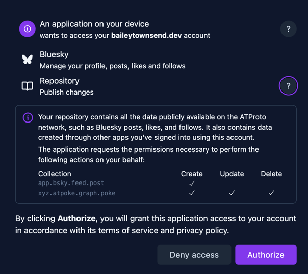

# ATProto SvelteKit Template

OAuth already figured out for you, a minimal template with ease of use oauth confidential client and local development. Along with a demo how to use the logged-in client. This is just a starting point, it's up to you to build the application.

## Features
- OAuth client configured from `.env` variables
- Server side sessions and automatic loading of the atproto client from `event.locals.atpAgent` on server side components.
- Examples on how to create atproto records with [pokes or making a Bluesky post](./src/routes/demo/+page.server.ts)
- Examples showing how to use [microcosm.blue](https://microcosm.blue/) tooling for an appview like experince without the appview.
  - See how many people and who [have poked](./src/routes/demo/+page.svelte) you with [constellation](https://constellation.microcosm.blue/)
  - Find the [handles from the did](./src/routes/demo/+page.svelte) easily with [slingshot](https://slingshot.microcosm.blue/)

## Dev Setup
Should work with any package manager if you prefer to use another. But these are directions for [pnpm](https://pnpm.io/)

1. Copy [.env.example](.env.example) to [.env](.env), .env.example is the default dev settings
2. `pnpm install`
3. May need to run `pnpm approve-builds` for the build scripts for sqlite
4. `pnpm run dev` or `pnpm run dev:logging` with [pino-pretty](https://github.com/pinojs/pino-pretty) for pretty logging

> If you are running locally on a different port than `5173` or something else odd can set `OAUTH_DOMAIN` .env to the domain and port. Just make sure to use either `127.0.0.1` or `[::1]`(ipv6) for oauth to work for local development.

## Implementation details
Details on some of the implementation details that you will most likely want to edit when creating your own project.

### How to configure OAuth
OAuth *should* Already be figured out for you with everything being configured from the environment variables without having to modify any code.

> All atproto actions taken for the user happen server side, so we can take advantage of the confidential client and longer session lifetimes.

## Types of OAuth clients
- Development local - Set `DEV=true` in `.env` to use a local development client. This is a special client just for development does not require having a public url. As outlined [here](https://atproto.com/specs/oauth#localhost-client-development). This is the default from copying the [.env.example](.env.example)
- Production Public – Remove the `DEV=true`, Set `OAUTH_DOMAIN` to your publicliy accessible domain([demo.atpoke.xyz](https://demo.atpoke.xyz) in `.env` to use a production public client. These have a lower atproto oauth session lifetime which is limited to 2 weeks. 
- Production Confidential - Follow `Production Public` and set `OAUTH_JWK` to the value from `node ./bin/gen-jwk.js`. **These are cryptographic signing keys and should be kept secret and private**. These have the longest session lifetime of 180 days for refresh tokens, or indefinitely if refreshed till, pending revocation or jwk rotation.

Most likely in production you are going to want the Confidential client for the longest lifetime.
The cookie session lifetime is less, so this could expire before the atproto session lifetime. This can be configured at [./src/lib/server/session.ts](./src/lib/server/session.ts), default is 30 days and resets for every logged-in web action. Can read more on atproto clients with [Client type details](https://atproto.com/specs/oauth#types-of-clients) and [session lifetime details](https://atproto.com/specs/oauth#tokens-and-session-lifetime)

## OAuth scopes 
OAuth scopes are permissions to the user's repo you are requesting. You can read more on them and learn the different ones on [atproto.com/specs/permission](https://atproto.com/specs/permission) 

This demo application only requires the access to the lexicons it needs with default scopes of `atproto repo:app.bsky.feed.post?action=create repo:xyz.atpoke.graph.poke`. This can be changed by setting the `OAUTH_SCOPES` environment variable. For development or full access to a user's repo you are probably looking for `atproto transition:generic`

> You may find as you're trying out new scopes that the OAuth screen may not reflect what you've requested. This is because the PDS can cache those. [Docs say this can be anywehre from 15-30mins](https://atproto.com/specs/permission#resolution-and-caching)

## OAuth Branding
There are a couple of other odds and ends you can set for OAuth to customize the branding. This mostly shows up on `yourpds.com/account` for now, but it is a standard and more may adpot it. Will be taking the [docs definitions](https://atproto.com/specs/oauth#client-id-metadata-document) for each.

- `OAUTH_CLIENT_NAME` - (string, optional): human-readable name of the client
- `OAUTH_LOGO_URI` - (string, optional): URL to client logo. Only https: URIs are allowed.
- `OAUTH_TOS_URI` - (string, optional): URL to human-readable terms of service (ToS) for the client. Only https: URIs are allowed.
- `OAUTH_POLICY_URI` - (string, optional): URL to human-readable privacy policy for the client. Only https: URIs are allowed.

### Database
This project uses [drizzle ORM](https://orm.drizzle.team/) with the sqlite adapter to make it easy to run locally and get started. This is used for the session store for the server and atproto. This will work for production as well and can build on it as is, but if you want to change out the database layer it should not be too bad since there's not a ton of db queries right now. This is a quick overview of that layer.

- [./src/lib/server/db/index.ts](./src/lib/server/db/index.ts). This sets up the DB
- [./src/lib/server/db/schema.ts](./src/lib/server/db/schema.ts). This is your database schema.
- [./src/lib/server/cache.ts](./src/lib/server/cache.ts). This is an abstracted key/value cache that the [@atproto/oauth-client-node](https://www.npmjs.com/package/@atproto/oauth-client-node?activeTab=readme) uses to store state and sessions.
- [./src/lib/server/session.ts](./src/lib/server/session.ts). This is the server side session store that is tied to the cookie session.
- A tiny job runs at [./src/hooks.server.ts](./src/hooks.server.ts) that clears the atproto state store, and runs migrations on startup. If you change from a node server adapter may have to change this as well.
- Will most likely need to change out some settings in [drizzle.config.ts](drizzle.config.ts)
- Delete the contents in [drizzle](drizzle) and run `pnpm run db:generate` to generate new migration files for the new adapter.

### Other production considerations
I did not find a great way to run a "sidecar process" with SvelteKit, and by that I mean a [Jetstream listener](https://docs.bsky.app/blog/jetstream) that runs alongside the SvelteKit application. If you are needing to listen to the firehose or jetstream to get real time records being created, I'd recommend changing out the database layered to something not embedded, then run a separate container (or process) with a node script running in a loop to get that data. [@atcute/jetstream](https://tangled.org/mary.my.id/atcute/tree/trunk/packages/clients/jetstream) is a great way to do this in TypeScript. 
For an overview of what that gets you and why you would want that I'd recommend checking out the quick start guide [Statusphere](https://atproto.com/guides/applications) to see how it is used there and why.

## Production

> Sign up for Railway with my referral code [z49xDi](https://railway.com?referralCode=z49xDi) to get $20 in credits, and if you spend anything, I get 15% in credits. 

### Railway
1. Install the railway cli ([directions here](https://docs.railway.com/guides/cli#installing-the-cli))
2. Login with `railway login`
3. Create a new project with `railway init`, set your project name
4. Deploy your webapp with `railway up`, this will create a new deployment. This will crash on the first run since we still have some changes to make. That is expected since we don't have a volume and our variables yet. This is what actually uploads your code to railway via the [dockerfile](Dockerfile).
   
5. `railway service` select the service you deployed earlier, name is most likely the same as the project name.
6. Run `railway volume add -m /app_data` to create a persistent volume for the sqlite database.
7. If you do not already have your project dashboard open you can open it with `railway open`, this opens it in a web browser.
8. Click on your service, then Variables. Add the following variables:
  * `OAUTH_DOMAIN` - your domain name
  * `OAUTH_JWK` - the value from `node ./bin/gen-jwk.js`
  * `DATABASE_URL` - `/app_data/local.db`

9. Go to settings and select "Custom Domain" to add your domain name. Follow the directions there

And then to update your project going forward you can run `railway up` again.

### Local server like a VPS
1. [Install docker](https://docs.docker.com/engine/install/)
2. Copy [.env.example](.env.example) to [.env](.env) and fill in the variables. Make sure to remove `DEV=true`
3. `docker-compose up`

> The docker compose comes with Caddy, if you have another reverse proxy you can remove it from the docker compose and just reverse proxy to port 3000.
> You may also have to play around with the Caddyfile depending on your setup.
